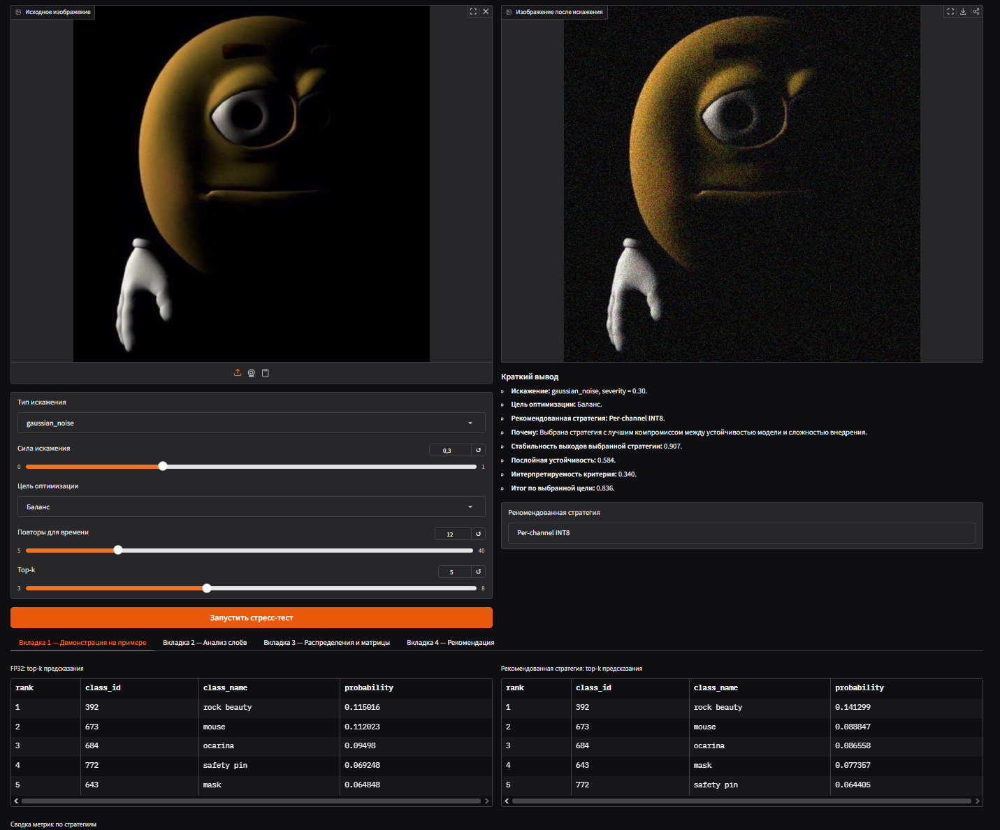
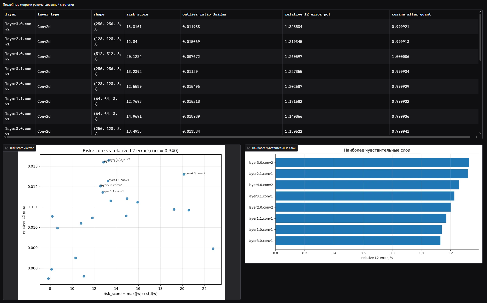
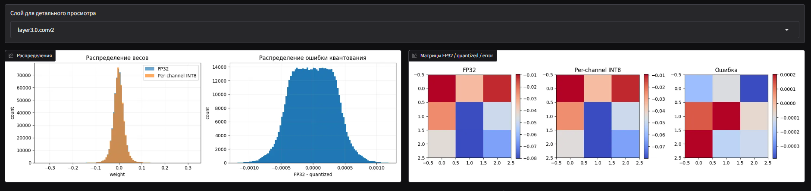
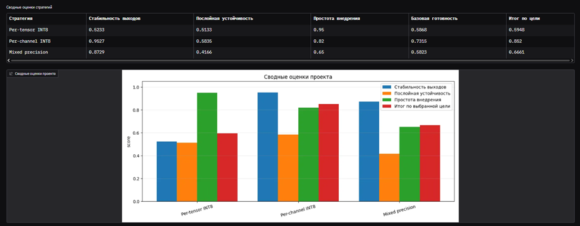

# QuantScope

Программный прототип для сравнения стратегий квантования нейросетевой модели.



На главном экране загружается изображение, задаются параметры эксперимента и выводится рекомендуемая стратегия.

## Описание

Проект сравнивает исходную **FP32**-модель и квантованные варианты модели **ResNet18**.  
Сравнение выполняется по предсказаниям, времени инференса и послойным метрикам.

Стратегии квантования:

- `Per-tensor INT8`
- `Per-channel INT8`
- `Mixed precision`
- `Native INT8`, если доступен

## Возможности

- загрузка изображения;
- добавление искажений;
- сравнение FP32 и квантованных моделей;
- оценка времени инференса;
- анализ чувствительных слоёв;
- выбор рекомендуемой стратегии.

## Установка

Рекомендуется **Python 3.10+**.

```bash
pip install torch torchvision gradio matplotlib numpy pandas pillow
```

## Запуск

```bash
python app_stress_v6.py
```

После запуска откройте локальную ссылку из терминала:

```text
http://127.0.0.1:7860
```

## Как пользоваться

1. Загрузить изображение.
2. Выбрать тип искажения.
3. Задать силу искажения.
4. Выбрать цель оптимизации.
5. Нажать **Запустить стресс-тест**.
6. Посмотреть таблицы, графики и рекомендацию.

## Анализ слоёв

На вкладке послойные метрики, связь `risk-score` с ошибкой и список наиболее чувствительных слоёв.



## Распределения и матрицы

На вкладке распределения весов, ошибка квантования и матрицы выбранного слоя.



## Рекомендация

На вкладке итоговые оценки стратегий и выбранный вариант квантования.



## Стресс-тесты

Доступные искажения:

- гауссов шум;
- размытие;
- снижение контрастности;
- затемнение;
- JPEG-сжатие.

Сила искажения задаётся параметром `severity`.

## Назначение

Проект используется для оценки влияния квантования на устойчивость модели и выбора подходящей стратегии.
